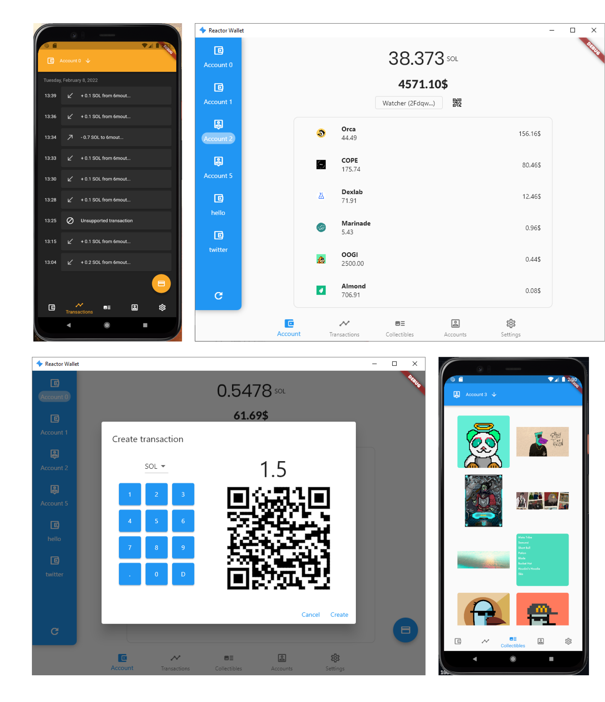

## Solana Mobile Wallet

A non-custodial Open Source Mobile wallet for Solana made in Flutter.

⚠ It's on **alpha**. WIP.

### 😎 Features
- Watch over any address you want
- Display SPL Tokens and transactions
- Import and create multiple wallets
- Show the USD equivalent of the address balance and all it's tokens combined




### 🎉 Support this project
You can support this project by donating any amount you want to these addresses;

- Solana: `5GzDDXyzhB9zA8vSHuEow5mQJ6Tk3kC4Bn2T9dp6nX3U`
- Bitcoin: `1HCBeYD564Y3AjQ3Ci6Fp2zosfZvevJuu6`

### 🏭 Building
```
flutter build apk --tree-shake-icons --split-per-abi
```

### 📝 Formatting
```
dart format . --line-length 100
```

### 🤔 To-do / Ideas
- [ ] **A name for the app**
- [ ] Seedphrases encryption
- [x] Mainnet/betanet/custom net support besides devnet
- [x] Ability to name and rename imported and created wallets, and watched addresses
- [x] Ability to make SOL transactions
- [x] Ability to refresh the current SOL value by pulling down
- [ ] Option to use another currency besides USD as equivalent currency
- [x] Display latest transactions
- [ ] Better project organization
- [ ] Ability to easily share an address (QR?)
- [ ] Have some UI tweaking options, like themes.
- [ ] Unit tests
- [x] Display owned tokens
- [ ] Ability to display NFTs owned by a wallet 
- [ ] Upload to https://itsallwidgets.com/
- [ ] Ability to add a small note when making transactions
- [ ] Ability to make transactions with SPL Tokens
- [ ] Better UX (specially when creating accounts)

MIT License
